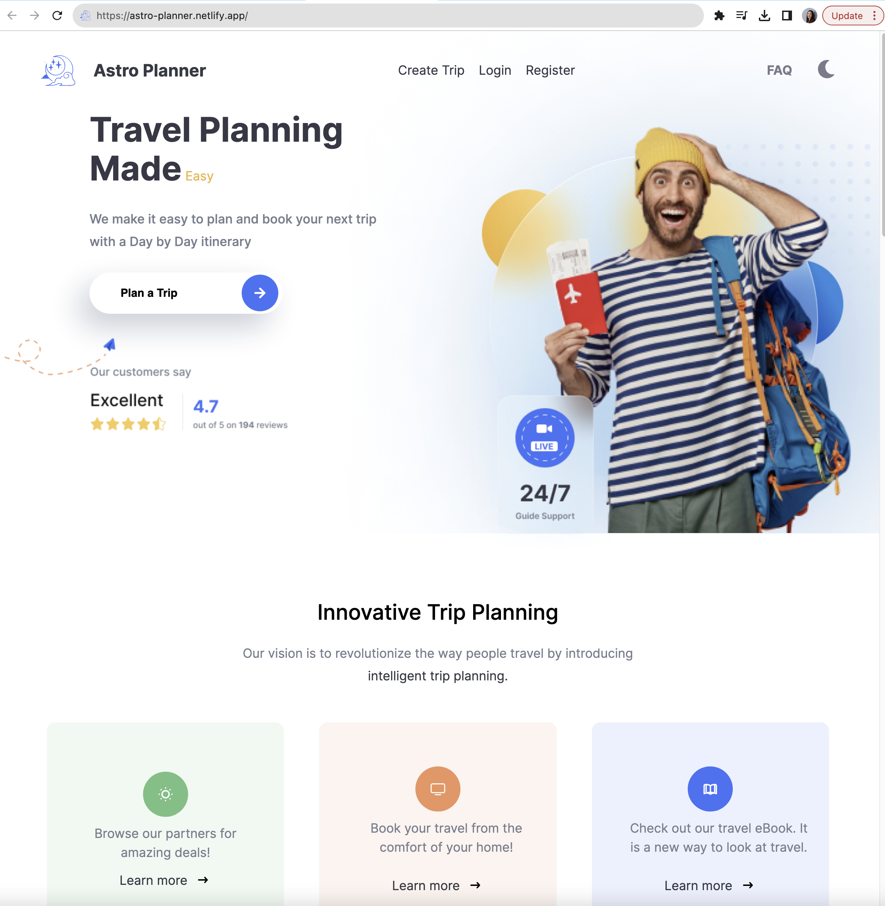
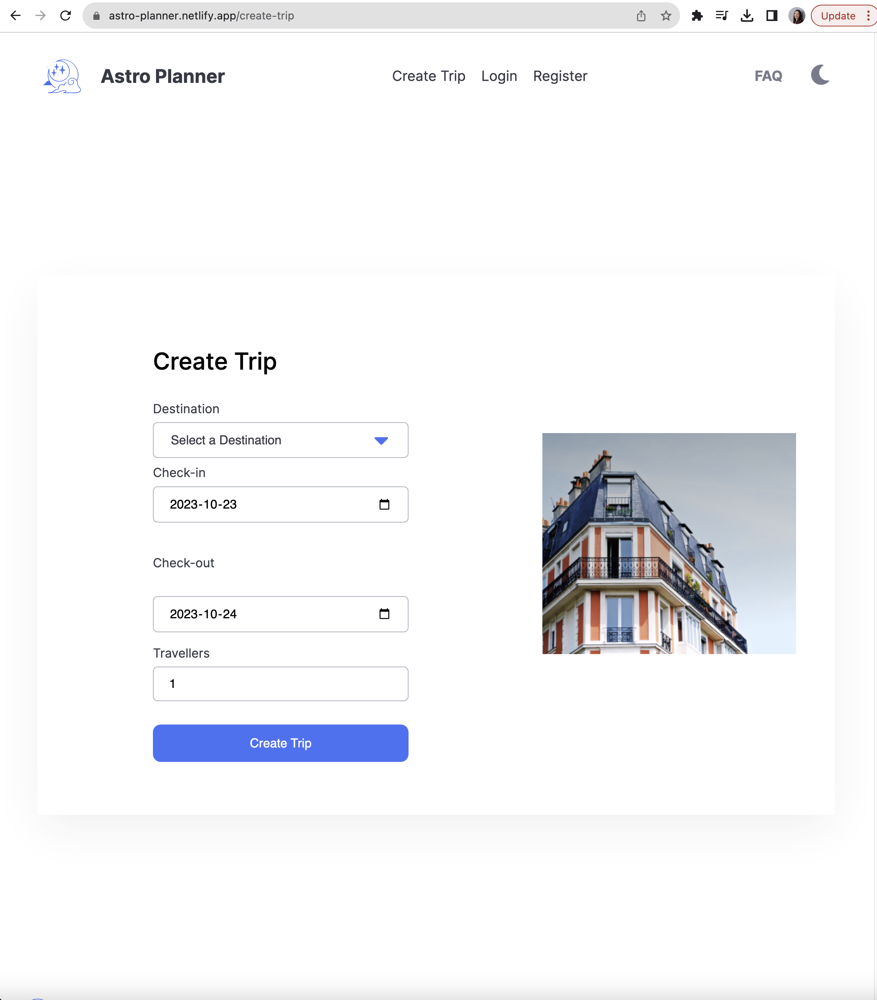

# Astro Planner Travel App: Create your perfect trip!    

[Astro Planner Live Link](https://astro-planner.netlify.app/)

## About

Welcome to the Astro Planner Travel App, a project dedicated to helping travel enthusiasts plan their journeys with celestial beauty. With this app, users can embark on a cosmic travel experience and explore destinations like never before.

## User Registration and Login

To begin using the Astro Planner Travel App, users first need to create an account by registering. If they already have an account, they can simply log in using their credentials.

## Creating a Travel Itinerary

After registration or login, users can create a travel itinerary. Here's how they do it:

a. Choose Destination: Users can select their desired travel destination.

b. Departure and Arrival Date: Users specify the dates when they plan to depart and return from their trip.

c. Flight, Hotel, and Car Rental Forms: Users have the option to enter specific details about their travel, such as their flight details, hotel accommodations, and car rental information. These forms allow users to input the relevant data for each part of their trip.

d. Skip Option: If users prefer to fill out these details later or if they don't have specific information at the moment, they can choose to skip this step and proceed to the next page.

Itinerary Creation: Once the necessary travel details are provided, the app generates an itinerary for the user's trip. This itinerary includes all the information about flights, hotel stays, and car rentals, helping users to visualize and organize their travel plans.

# Managing Your Trips
Users have the option to manage their created trips. They can edit the details of an existing trip or delete it if their plans change or if they no longer need the trip information.

Podcast Planner was built by these team members.

* [Monica Benavides](https://github.com/monibena)
* [Luis Rodrigo Bueno Martinez](https://github.com/renata1026)
* [Renata Reinartz](https://github.com/renata1026)
* [Ronald Paek](https://github.com/ronaldpaek)

Thank you for your interest in Travel Planner! We hope you find it useful and look forward to hearing from you.    

## Advanced Web Development Tools Used in This Project

The Astro Planner Travel App leverages several advanced web development tools to provide users with a seamless and feature-rich experience:

* **Front-End Framework**: We've built the app's user interface using the React library, allowing for a dynamic and responsive user experience.

* **Back-End Server**: The back-end is powered by an Express server, which handles various functionalities, such as user authentication, itinerary management, and more.

* **Authentication**: To ensure user data is secure, we've implemented authentication using JSON Web Tokens (JWTokens) and Bcrypt for password hashing. This keeps user information protected and confidential.

* **Database Schema**: The backbone of our application is powered by Prisma Schema, enabling efficient data management and storage.

* **Full CRUD (Create, Read, Update, Delete)**: Our goal is to deliver a professional Full CRUD application, which means users have complete control over their travel plans, from creating and viewing itineraries to editing and deleting trips.

* **Responsive Design**: We've implemented basic mobile responsiveness, ensuring users can access the Astro Planner from a variety of devices, such as computers, tablets, and smartphones.

By employing these advanced web development tools, we've created an application that combines functionality, user-friendliness, and a visually engaging user interface, providing travel enthusiasts with a comprehensive planning experience.

## Features

* Stunning Landing Page: A visually captivating starting point for your travel journey.
* Secure Login & Registration: Hassle-free account creation and access.
* Mobile Responsiveness: Accessible from various devices for on-the-go planning.
* Itineraries: Users can save their travel itinerary as well as edit and delete trips.

By offering these features, the Astro Planner Travel App empowers users to efficiently plan, save, and adjust their travel itineraries according to their preferences and evolving plans.

## Video WalkThrough

[Watch Video Walkthrough](https://www.loom.com/share/39bfc6f1064b4fe3956945451426e4d6?sid=750cfc77-dae1-4f11-a68d-df26e6bcb860)

<table>
  <tr>
    <td></td>
    <td></td>
    <td></td>
   </tr>
</table>

 

